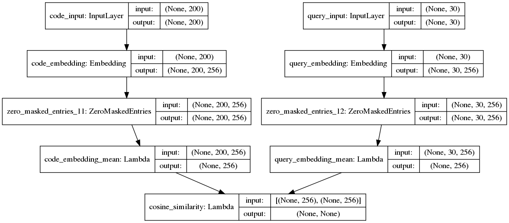

# CodeSnippetSearch

CodeSnippetSearch is a web application and a web extension that allows you to search GitHub repositories using natural language
queries and code itself. 

It is based on a neural bag of words code search implementation using PyTorch and data from the [CodeSearchNet](https://github.com/github/CodeSearchNet) project.
The model training code was heavily inspired by the baseline (Tensorflow) implementation in the CodeSearchNet repository. 
Currently, Python, Java, Go, Php, Javascript, and Ruby programming languages are supported.

Helpful papers:
* [CodeSearchNet Challenge: Evaluating the State of Semantic Code Search](https://arxiv.org/pdf/1909.09436.pdf)
* [When Deep Learning Met Code Search](https://arxiv.org/pdf/1905.03813.pdf)

## Model description

## Model structure

## Project structure
- `code_search`: A Python package with scripts to prepare the data, train the language models and save the embeddings
- `code_search_web`: CodeSnippetSearch website Django project
- `serialized_data`: Store for intermediate objects during training (docs, vocabularies, models, embeddings etc.)
- `codesearchnet_data`: Data from the CodeSearchNet project

## Data

We are using the data from the CodeSearchNet project. Run the following commands to download the required data:

- `$ ./scripts/download_codesearchnet_data.sh`

This will download around 20GB of data. Overview of the data structure is listed [here](https://github.com/github/CodeSearchNet/tree/master/resources).

## Training the models

If you can, you should be performing these steps inside a virtual environment.
To install the required dependencies run: `$ ./scripts/install_pip_packages.sh`.
To install the `code_search` as a package run: `$ ./scripts/install_code_search_package.sh`

### Preparing the data

Data preparation step is separate from the training step because it is time and memory consuming. We will prepare all the
necessary data needed for training. This includes preprocessing code docs, building vocabularies, and encoding sequences.

The first step is to parse the CodeSearchNet data. We need to parse `*_dedupe_definitions_v2.pkl` files from a `pickle` format to `jsonl` format. We will be using the jsonl
format throughout the project, since we can read the file line by line and keep the memory footprint minimal. Reading the
evaluation docs requires **more** than 16GB of memory, because the entire file has to be read in memory (largest is `javascript_dedupe_definitions_v2.pkl` at 6.6GB).
If you do not have this kind of horsepower, I suggest renting a cloud server with >16GB of memory and running this step on there. After you are done,
just download the jsonl files to your local machine. Subsequent preparation and training steps should not take more than 16GB of memory.

To parse the CodeSearchNet data run: `$ python parse_codesearchnet_data.py`

To prepare the data for training run: `$ python prepare_data.py --prepare-all`. It uses the Python multiprocessing
module to take advantage of multiple cores. If you encounter memory errors or slow performance you can tweak the number of
processes by changing the parameter passed to `multiprocessing.Pool`.

### Training and evaluation

You start the training by running: `$ python train.py`. This will train separate models for each language, build code embeddings
and evaluate them according to MRR (Mean Reciprocal Rank) and output `model_predictions.csv`. These will be evaluated by Github & WANDB 
using NDCG (Normalized Discounted cumulative gain) metric to rank the submissions.

### Query the trained models

Run `$ python search.py "read file lines"` and it will output 3 best ranked results for each language.
